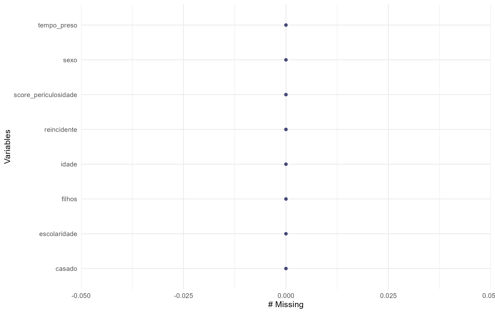
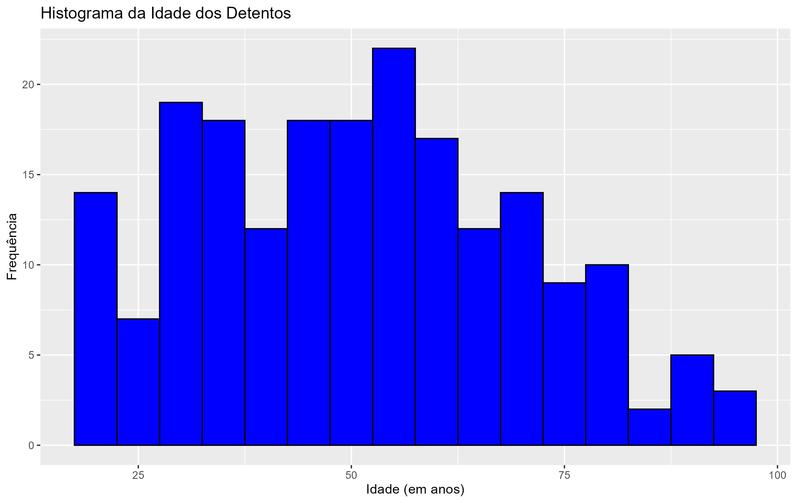
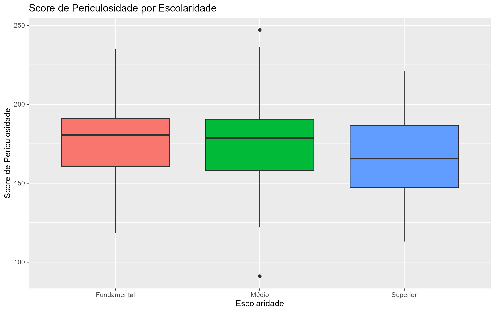
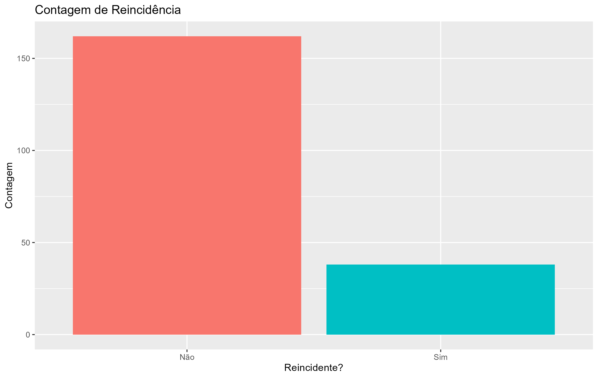
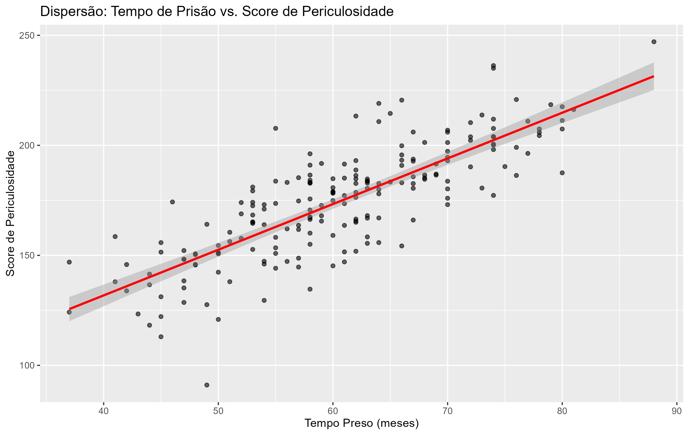

# AnaliseExploratoria
Atividade de prática 2

Dados Faltantes: A análise inicial mostra que a base de dados está completa, sem nenhum valor faltante (missing), o que é excelente para a análise.



Histograma de Idade: A distribuição das idades  é bastante ampla, variando de indivíduos com menos de 20 anos até alguns com mais de 90. A maior concentração de detentos parece estar na faixa dos 30 aos 60 anos.



Boxplot do Tempo de Prisão: O gráfico  indica que a mediana do tempo de prisão está em torno de 60 meses (5 anos). A distribuição é relativamente simétrica, com 50% dos detentos (a "caixa") tendo entre 50 e 70 meses de prisão. Existem alguns valores atípicos (outliers) indicando indivíduos com tempo de prisão muito abaixo ou muito acima do grupo principal.


Score por Escolaridade: Ao analisar o score de periculosidade por escolaridade, não observamos uma diferença drástica entre as medianas dos grupos. No entanto, o grupo "Superior" parece ter uma variabilidade (o tamanho da caixa) ligeiramente menor em comparação com os grupos "Fundamental" e "Médio".



Gráfico de Reincidência: O gráfico de barras deixa claro que a grande maioria dos indivíduos nesta amostra não é reincidente. A contagem de "Sim" é significativamente menor que a de "Não".



Gráfico de Dispersão: indica uma boa relação entre o score de periculosidade e o tempo preso, com a linha de regressão bastante evidente.




```
 score_periculosidade     idade        tempo_preso   
 Min.   : 91.05       Min.   :18.00   Min.   :37.00  
 1st Qu.:155.70       1st Qu.:34.00   1st Qu.:53.75  
 Median :177.21       Median :52.00   Median :60.50  
 Mean   :174.52       Mean   :50.91   Mean   :60.59  
 3rd Qu.:191.12       3rd Qu.:64.25   3rd Qu.:67.00  
 Max.   :247.07       Max.   :97.00   Max.   :88.00  

```

correlação : 0.8037558

"Score de Periculosidade:"

variancia
 660.5837

desvio_padrao
 25.70182

amplitude
 156.02

"Idade:"

variancia
 374.0782

desvio_padrao
 19.3411

amplitude
 79

"Tempo Preso:"

variancia
 99.08822

desvio_padrao
 9.954306

amplitude
 51
